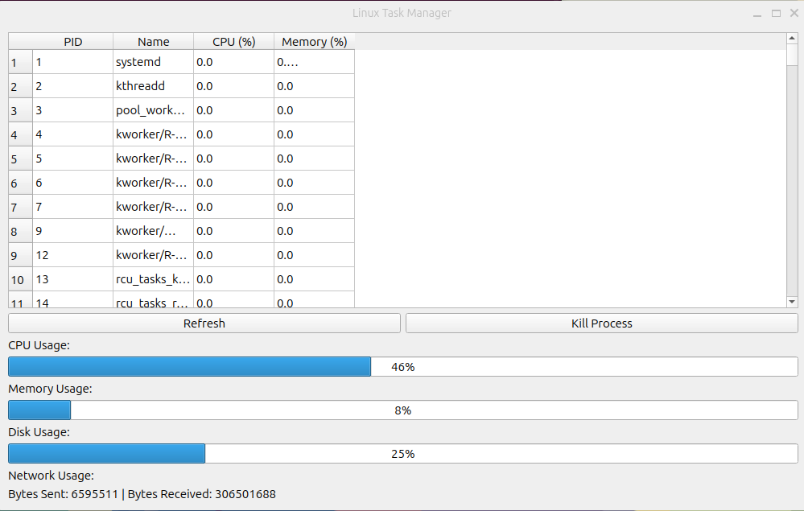

# Linux Task Manager

A simple task manager application for Linux, built with **PyQt** and **psutil**, to mimic the functionality of the Windows Task Manager. It provides real-time insights into system metrics and allows you to manage processes efficiently.

---

## Features

- **Process Management**:
  - View running processes with their PID, Name, CPU Usage, and Memory Usage.
  - Sort processes by column (PID, Name, CPU, Memory) in ascending or descending order.
  - Kill selected processes.

- **System Metrics**:
  - Real-time CPU usage.
  - Memory usage (total, used, free).
  - Disk usage.
  - Network activity (bytes sent/received).

- **Live Updates**:
  - Metrics refresh every second.

---

## Screenshot



---

## Installation

1. Clone the repository:
   ```
   git clone https://github.com/yourusername/linux-task-manager.git
   cd linux-task-manager
   ```
2. Intall dependencies:
   ```
   sudo apt-get install psutil
   sudo apt-get install python3-pyqt5
   ```
3. Run program:
   ```
   python3  gui.py
   ```
## Usage:
- **Refresh**: Click the Refresh button to reload the process table.
- **Kill Process**: Select a process and click Kill Process to terminate it.
- **Sort Processes**: Click on any column header to sort the table by that column.

